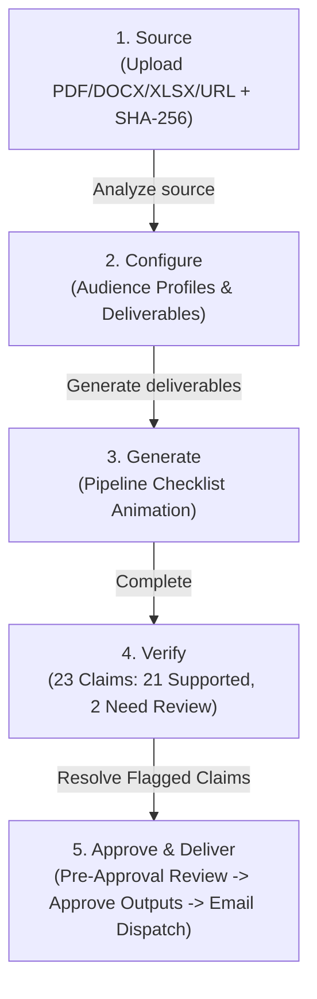

# Implementation Plan: TRUST-X (Trusted Content Transformation Platform)

Refactor the existing React prototype into a production-style enterprise MVP called **TRUST-X** (*"Transform trusted information into verified communication"*). This plan preserves all existing functional capabilities while providing a clean, modular architecture, a unified central data model, a 5-step transformation workflow with strict governance gating, and dedicated application pages.

---

## User Review Required

> [!IMPORTANT]
> **Key Architectural Decisions for User Review:**
> 1. **Central Data Model**: A single unified `Transformation` object (`source`, `analysis`, `profiles`, `claims`, `outputs`, `review`, `delivery`, `audit`) will serve as the single source of truth across all components and services.
> 2. **5-Step Transform Flow**: `Source` $\rightarrow$ `Configure` $\rightarrow$ `Generate` $\rightarrow$ `Verify` $\rightarrow$ `Approve & Deliver`.
> 3. **Strict Approval Gating**: The "Approve Outputs" action is strictly disabled until all 23 claims are resolved (initially 21 Supported, 2 Need Review). Once resolved, the status transitions to `APPROVED`, unlocking the "Send Communication" delivery flow.
> 4. **Decoupled Service Layer**: Mock services (`documentService`, `generationService`, `verificationService`, `deliveryService`, `auditService`, `authService`) will expose async Promise-based APIs ready for backend integration without rewriting UI components.
> 5. **Navigation**: Top header navigation: `Dashboard`, `Transform`, `Documents`, `Review`, `Audit`, with `Settings` in the secondary/bottom section.

---

## Proposed Changes

### Component & File Architecture

```
src/
├── types/
│   ├── transformation.ts       # Central Transformation, Source, Analysis, Profile, Delivery types
│   ├── claim.ts                # GroundingClaim (SUPPORTED | UNSUPPORTED | EDITED | RESOLVED)
│   ├── output.ts               # OutputDeliverable (Executive Brief, Tech Advisory, Comm Package)
│   ├── audit.ts                # AuditEvent with SHA-256 cryptographic linkage
│   └── user.ts                 # UserSession and Role types
│
├── data/
│   └── demoData.ts             # Centralized realistic dataset (Cybersecurity Threat Report, 23 claims)
│
├── services/
│   ├── api.ts                  # Shared mock API client / delay helpers
│   ├── documentService.ts      # Upload & analysis service with Web Crypto SHA-256
│   ├── generationService.ts    # Multi-audience generation pipeline
│   ├── verificationService.ts  # Claim status updates, edits, and resolutions
│   ├── deliveryService.ts      # Email dispatch & recipient management
│   ├── auditService.ts         # Tamper-evident event ledger recording
│   └── authService.ts          # Session and role management
│
├── store/
│   └── AppContext.tsx          # Central React context maintaining transformation state & active views
│
├── components/
│   ├── shell/
│   │   ├── Header.tsx          # Clean top header (Brand, 5 Primary Nav links, Search, Notifications, User)
│   │   └── SettingsModal.tsx   # Settings modal / page for profiles & platform preferences
│   ├── common/
│   │   ├── Badge.tsx           # Semantic status badges (✓ Supported, ⚠ Needs Review, Approved, etc.)
│   │   ├── Button.tsx          # Enterprise button variants
│   │   ├── Modal.tsx           # Accessible modal container
│   │   ├── Toast.tsx           # Contextual toast notifications ("Audit recorded ✓")
│   │   └── SearchPalette.tsx   # ⌘K Command palette across documents and claims
│   ├── transform/
│   │   ├── Step1Source.tsx     # Drag & drop upload with file formats (PDF, DOCX, XLSX, TXT, etc.)
│   │   ├── Step2Configure.tsx  # Audience cards (Executive, Cybersecurity, Media) + Deliverables checklist
│   │   ├── Step3Generate.tsx   # Pipeline processing checklist animation
│   │   ├── Step4Verify.tsx     # 23 claims matrix (21 Supported, 2 Need Review) with side-by-side evidence
│   │   └── Step5Delivery.tsx   # Document previews -> Gated Approval -> Email delivery simulation
│
└── pages/
    ├── DashboardPage.tsx       # Welcome greeting, 4 high-level stats, Recent Transformations table
    ├── TransformPage.tsx       # Guided 5-step transformation workflow container
    ├── DocumentsPage.tsx       # Repository of source documents with status & outputs
    ├── ReviewPage.tsx          # Centralized review queue with status filters (All, Pending, Approved)
    ├── AuditPage.tsx           # Full chronological event history with cryptographic hash verification
    └── LoginPage.tsx           # Role-based workspace initialization
```

---

## Detailed Component Specifications

### 1. Central Data Model (`src/types/transformation.ts` & `src/data/demoData.ts`)
- **Primary Transformation Object**:
  ```ts
  export interface Transformation {
    id: string; // e.g. "TX-2026-00124"
    title: string;
    source: {
      id: string;
      name: string;
      type: 'PDF' | 'DOCX' | 'XLSX' | 'TXT' | 'PNG' | 'JPG' | 'MP4' | 'URL';
      pages: number;
      size: string;
      sha256: string;
      uploadedAt: string;
    };
    analysis: {
      findings: number;
      risks: number;
      recommendations: number;
      entities: number;
      evidence: number;
      importantData: number;
      keySummary: string[];
    };
    profiles: AudienceProfile[];
    claims: GroundingClaim[];
    outputs: OutputDeliverable[];
    review: {
      status: 'PENDING' | 'READY_FOR_APPROVAL' | 'APPROVED';
      reviewer: string | null;
      approvedAt: string | null;
    };
    delivery: {
      status: 'NOT_SENT' | 'SENT';
      recipients: EmailRecipient[];
      sentAt: string | null;
      subject: string;
      message: string;
    };
    audit: AuditRecord[];
  }
  ```

- **Claims Structure (23 Total Claims)**:
  - 21 claims initialized as `SUPPORTED` with page anchors.
  - 2 claims initialized as `UNSUPPORTED` / `NEEDS_REVIEW`:
    - **Claim #5**: Frequency oscillation assertion on Page 19.
    - **Claim #17**: Threat actor attribution timing discrepancy on Page 14.
  - Resolving both claims updates them to `RESOLVED` / `SUPPORTED`, transitioning document review status to `READY_FOR_APPROVAL`.

---

### 2. Five-Step Transform Workflow



- **Step 1 (Source)**:
  - Supports `PDF`, `DOCX`, `XLSX`, `TXT`, `PNG`, `JPG`, `MP4`, `Article URL`.
  - Drag-and-drop file upload with real browser Web Crypto SHA-256 hash calculation.
  - Quick sample preset selectors (*"Cybersecurity Threat Intelligence Research Report.pdf"*).
  - Displays: Document name, File type, Size, Pages, Uploaded status.
  - Action: `"Analyze source"`.

- **Step 2 (Configure)**:
  - Selectable Audience Profile Cards:
    - **Executive Leadership**: Formal · Concise · English | Decision Making | Executive Brief
    - **Cybersecurity Department**: Technical · Detailed · English | Threat Remediation | Technical Advisory
    - **Media & Communications**: Public · Clear · English | Stakeholder Advisory | Communication Package
  - Deliverables Checklist: Auto-populated and editable (Executive Brief, Technical Advisory, Communication Package, Presentation Slides).
  - Action: `"Generate deliverables"`.

- **Step 3 (Generate)**:
  - Document transformation checklist with animated progress:
    - `Source analyzed ✓`
    - `Audience requirements mapped ✓`
    - `Executive Brief generated ✓`
    - `Technical Advisory generated ✓`
    - `Communication Package generated ✓`
    - `Verification pending`

- **Step 4 (Verify)**:
  - Metrics Header: `23 claims checked` • `21 Supported` • `2 Need Review` • `0 Resolved Issues`.
  - Side-by-side verification workbench:
    - **Left**: Claim cards with clear hierarchy:
      $$\text{Generated Claim} \longrightarrow \text{Source Reference} \longrightarrow \text{Evidence Quote} \longrightarrow \text{Status}$$
    - **Right**: Document viewer showing yellow highlighted anchor passage on corresponding page.
  - Actions: `Replace with exact phrasing`, `Accept`, `Edit`, `Remove`.
  - Resolving both flagged claims drops `Needs Review` to `0`, transitioning to `READY_FOR_APPROVAL`.

- **Step 5 (Approve & Deliver)**:
  - **Part A: Document Previews**:
    - Tabs for `Executive Brief (v1.2)`, `Technical Advisory (v1.1)`, `Communication Package (v1.0)`.
  - **Part B: Approval Gate**:
    - Shows `All claims verified ✓`, `Issues remaining: 0`, Reviewer info, timestamp.
    - `"Approve outputs"` button is disabled until all claims are resolved.
    - Clicking `"Approve outputs"` stamps status as `APPROVED` and records an audit block.
  - **Part C: Delivery Simulation (Unlocked upon Approval)**:
    - Shows configured recipients (To, Cc, Subject, Message, PDF/DOCX attachments).
    - Actions: `Preview Email`, `Edit Email`, `Send Communication`.
    - On click `"Send Communication"`: Transitions to `✓ Communication sent successfully` with recipient list, delivery timestamp, and dispatch record.

---

### 3. Application Pages

#### A. Dashboard (`#/dashboard`)
- Header: *"Good morning, Operator. Transform trusted organizational information into verified communication."*
- Primary CTA: `+ New Transformation`.
- 4 Compact Statistics:
  - **Transformations**: `12`
  - **Deliverables**: `36`
  - **Pending Review**: `2`
  - **Approved**: `10`
- **Recent Transformations Table**: Document, Status, Outputs, Last updated, Action.

#### B. Documents Page (`#/documents`)
- Repository of all active and archived documents with search & status filters.
- Shows: Source document, Type, Uploaded date, Transformation status, Outputs, Last activity.

#### C. Review Page (`#/review`)
- Centralized review queue with filter tabs: `All`, `Pending Review`, `Approved`, `Rejected`.
- Direct `"Review"` action opening the verification/approval workbench.

#### D. Audit Page (`#/audit`)
- Complete chronological audit ledger:
  - Document uploaded $\rightarrow$ Source analyzed $\rightarrow$ Claims extracted $\rightarrow$ Claims flagged $\rightarrow$ Claim edited $\rightarrow$ Verification completed $\rightarrow$ Reviewer approved $\rightarrow$ PDF exported $\rightarrow$ Communication delivered.
- Each event row expandable to view Actor, Action, Object, Status, Previous Hash, Current Hash, and `"Audit integrity verified"`.

#### E. Settings (`#/settings` / Modal)
- Organization profile, default audience profiles, and verification sensitivity settings.

---

## Verification Plan

### Automated Build Verification
- Run TypeScript type checks: `npx tsc --noEmit`
- Run Vite production bundle: `npm run build`

### Manual & Subagent End-to-End QA
1. **Login**: Role selection to initialize secure session.
2. **Dashboard**: Verify greeting, 4 stats, and recent transformations table.
3. **Transform Workflow**:
   - Step 1: Upload / select sample preset $\rightarrow$ Verify SHA-256 calculation $\rightarrow$ Click *"Analyze source"*.
   - Step 2: Select audience profiles $\rightarrow$ Verify deliverables checklist $\rightarrow$ Click *"Generate deliverables"*.
   - Step 3: Verify generation checklist transition.
   - Step 4: Verify 23 claims (21 supported, 2 need review). Verify that clicking *"View evidence"* jumps to highlighted source page. Resolve both flagged claims $\rightarrow$ Verify count becomes 23 supported / 0 need review.
   - Step 5: Verify document preview tabs. Click *"Approve outputs"* $\rightarrow$ Verify status changes to `APPROVED`. Verify email delivery form unlocks. Click *"Send Communication"* $\rightarrow$ Verify successful delivery confirmation.
4. **Documents & Review Pages**: Verify navigation and filtering.
5. **Audit Page**: Verify full tamper-evident event chain from upload to delivery.
