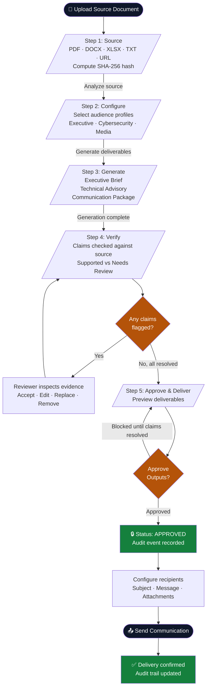
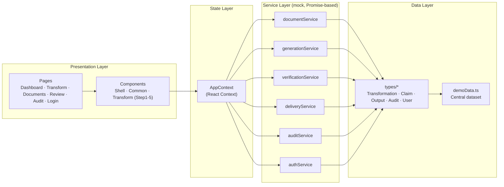

# SourceFlow Platform (TRUST-X)

**Transform trusted information into verified communication.**

SourceFlow (internally codenamed **TRUST-X**) is a front-end enterprise MVP that simulates a document-intelligence and content-transformation pipeline. It takes a source document (report, threat brief, memo, etc.), generates audience-specific deliverables from it, runs every generated claim through a source-grounding verification workbench, and gates final delivery behind a strict human-approval and cryptographic-audit process.

Live demo: [sourceflow-platform.vercel.app](https://sourceflow-platform.vercel.app)

---

## ✨ Key Features

- **Multi-format ingestion** — drag-and-drop upload for PDF, DOCX, XLSX, TXT, PNG, JPG, MP4, or an article URL, with real browser Web Crypto SHA-256 hashing for tamper-evidence.
- **Audience-aware generation** — select audience profiles (Executive Leadership, Cybersecurity Department, Media & Communications) to auto-populate the right deliverables (Executive Brief, Technical Advisory, Communication Package, Presentation Slides).
- **Claim-level grounding verification** — every generated claim is checked against the source document side-by-side, with statuses (`Supported`, `Needs Review`, `Edited`, `Resolved`) and highlighted evidence passages.
- **Gated approval workflow** — the "Approve Outputs" action is locked until all flagged claims are resolved, ensuring nothing ungrounded reaches delivery.
- **Simulated delivery** — configure recipients, subject, and message, then dispatch the approved package and record the send.
- **Tamper-evident audit trail** — every action (upload → analyze → generate → flag → resolve → approve → deliver) is logged as a chained, hash-linked audit event.
- **Institutional design system** — a defense-grade / government-console visual language (deep navy & slate, Inter + JetBrains Mono, strict spacing and elevation tokens) documented in [`DESIGN.md`](./DESIGN.md).

---

## 🧭 The 5-Step Transformation Workflow

Every document moves through a single guided pipeline before it can be delivered:

1. **Source** — Upload or select a sample document; a SHA-256 hash is computed for integrity.
2. **Configure** — Choose audience profiles and the deliverables to generate.
3. **Generate** — The pipeline produces each deliverable with an animated progress checklist.
4. **Verify** — Every generated claim is checked against the source; flagged claims must be resolved.
5. **Approve & Deliver** — Once all claims are resolved, outputs can be approved and dispatched to recipients.

See the diagram below for the full flow, including the approval gate.

---

## 🗺️ Workflow Diagram



---

## 🏗️ Application Architecture



---

## 🛠️ Tech Stack

| Layer | Technology |
|---|---|
| Framework | React 18 + TypeScript |
| Build tool | Vite 6 |
| Styling | Tailwind CSS 3, PostCSS, Autoprefixer |
| Icons | lucide-react |
| Utilities | clsx, tailwind-merge |
| State | React Context (`AppContext`) |
| Data | Centralized mock dataset (`demoData.ts`) — no backend required |

---

## 📁 Project Structure

```
sourceflow-platform/
├── public/                  # Static assets
├── src/
│   ├── types/                # Transformation, Claim, Output, Audit, User types
│   ├── data/                  # Centralized demo dataset
│   ├── services/              # Mock async services (document, generation, verification, delivery, audit, auth)
│   ├── store/                 # AppContext — central React state
│   ├── components/
│   │   ├── shell/              # Header, SettingsModal
│   │   ├── common/              # Badge, Button, Modal, Toast, SearchPalette
│   │   └── transform/            # Step1Source ... Step5Delivery
│   └── pages/                 # DashboardPage, TransformPage, DocumentsPage, ReviewPage, AuditPage, LoginPage
├── DESIGN.md                 # Full design system specification
├── IMPLEMENTATION_PLAN.md    # Architecture & implementation plan
├── index.html
├── package.json
├── tailwind.config.js
├── postcss.config.js
├── tsconfig.json
└── vite.config.ts
```

---

## 🚀 Getting Started

### Prerequisites
- Node.js 18+
- npm

### Installation

```bash
git clone https://github.com/vishal0-7/sourceflow-platform.git
cd sourceflow-platform
npm install
```

### Development

```bash
npm run dev
```

Starts the Vite dev server (default: `http://localhost:5173`).

### Build

```bash
npm run build
```

Type-checks with `tsc` and produces a production build via Vite.

### Preview production build

```bash
npm run preview
```

---

## 📚 Additional Documentation

- [`DESIGN.md`](./DESIGN.md) — Full design system spec (color tokens, typography, spacing, component styling).
- [`IMPLEMENTATION_PLAN.md`](./IMPLEMENTATION_PLAN.md) — Detailed architecture, data model, and page-by-page implementation plan.

---

## 📝 License

No license has been specified for this repository yet. Add a `LICENSE` file to define usage terms.
